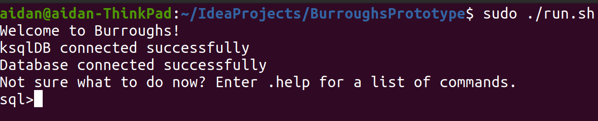
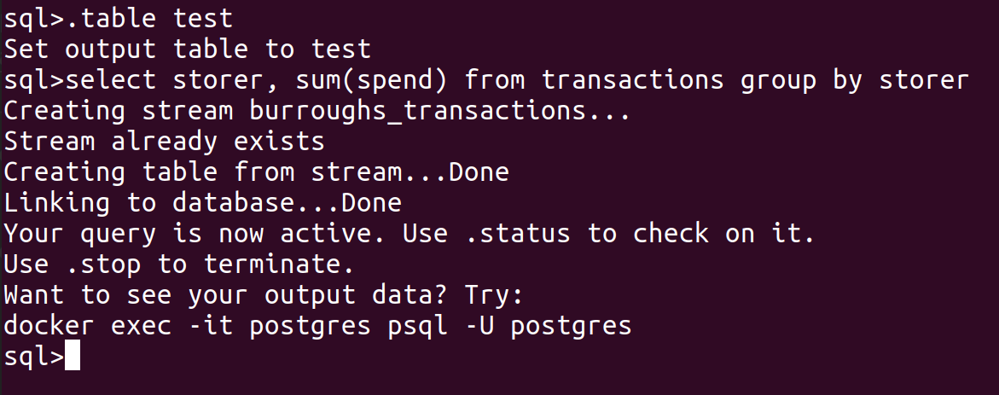
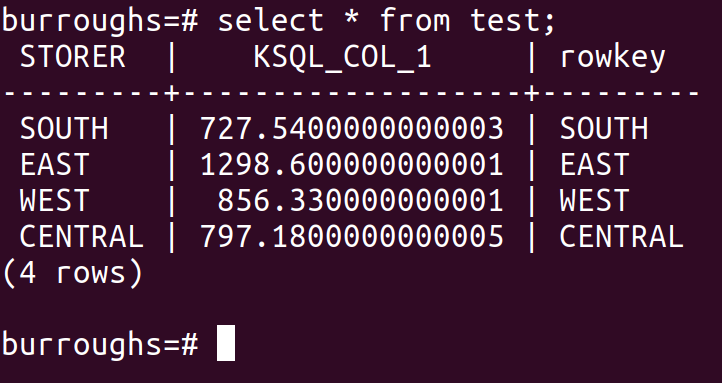
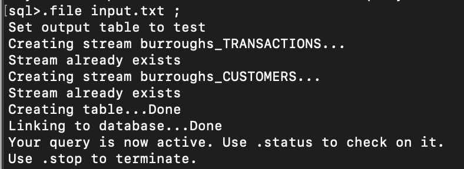

# Burroughs Prototype
## Table of Contents
- [Burroughs Prototype](#burroughs-prototype)
  - [Table of Contents](#table-of-contents)
  - [Quick Start](#quick-start)
    - [1. Confluent Platform Setup](#1-confluent-platform-setup)
    - [2. Running Burroughs](#2-running-burroughs)  
    - [3. Test Data](#3-test-data)
    - [4. Executing a simple query](#4-executing-a-simple-query)
    - [5. Reading commands from a file](#5-reading-commands-from-a-file)
    - [Running the Burroughs Browser Interface](#Running-the-Burroughs-Browser-Interface)
  - [System Configuration](#system-configuration)
    - [Environment Variables](#environment-variables)
    - [Producers](#producers)    
## Quick Start

Requirements
- Docker
- Maven

### 1. Confluent Platform Setup

The first thing you'll need to do is start up the Confluent platform containers (Zookeeper, Kafka, KsqlDB, etc.) and the PostgreSQL database, all of which are contianed in the Confluent directory. You'll also need to build the custom Kafka Connect image which contains custom Burroughs single message transforms.
```bash
cd SingleMessageTransforms
./buil-connect.sh
cd ../Confluent
docker-compose up -d
```

Give it a couple seconds and then make sure that everything is running by doing `docker-compose ps`. If anything has exited, just start it again.


### 2. Running Burroughs
First, you will need to build Burroughs from source. To do so, run the following (from the root directory).
```bash
./build.sh
```
To run Burroughs on Linux or MacOS run this:
```bash
./run.sh
```

To run Burroughs on Windows run this:
```bash
./run-windows.bat
```

If you setup everything successfully, you should see something like the following.


You can use `.help` to see a list of useful commands that are available.

### 3. Test Data
To actually make use of Burroughs, you'll want some data to play with. This repository contains a demo CSV file and default producer to accomplish this. To run it, execute the following.
```burroughs
.producer transactions_producer start 10000
```
The above command will produce 10000 records to a Kafka topic for testing. You may specify any limit you like up to the 100,000 records that are in the file or no limit at all to dump everything.


### 4. Executing a simple query
First, we will need to set a name for our output table: 
```burroughs
.table test
```
Once that is done, enter the following:
```sql
select storer, sum(spend) from transactions group by storer
```
If everything works correctly, the output should look like this:



To see your data, open a second terminal and enter the following:
```bash
docker exec -it postgres psql -U postgres burroughs
```

You should now be able to view your results:



When you're done, don't forget to run `.stop` to clean up all of the stream processing infrastructure. `.quit` or Ctrl+D exits the burroughs shell.

### 5. Reading commands from a file
Burroughs can read commands from a file, simply by using the .file command. Commands in the file can either be sql or burroughs commands. All files should be put in the /commands folder. 
```burroughs
.file <filename> <delimiter>
```
Example file:
```input.txt
.producer transactions_producer start 10000; .producer customers_producer start 10000; .table test; select t.basketnum, count(c.CustId) from transactions as t left join customers as c on c.basketnum = t.basketnum group by t.basketnum;
```
Example command:
```burroughs
.file input.txt ;
```


### Running the Burroughs Browser Interface
Burroughs also ships with a browser-based graphical user interface. To use this, do the following:

1. `cd burroughs-server`
2. `./build.sh`
3. `./run-client.sh`
4. Navigate to http://localhost:5000 in the browser.

## System Configuration
### Environment Variables
Connections between Burroughs and the other components of the stream processing pipeline, Kafka, KsqlDB, and PostgreSQL, are defined by a handful of environment variables. Not all of these variables are required, as many of them have reasonable defaults. If you use Burroughs with the packaged version of the Confluent Platform as described in the previous section, you shouldn't need to change anything. The below table provides a complete list.

| Variable | Description |
| -------- | ----------- |
| KSQL_HOST | The hostname and port number for the ksqldb server. | 
| DB_HOST | The hostname and port for the PostgreSQL database. |
| DB_USER | The database user to provide when connecting. |
| DB_PASSWORD | The database password |
| DATABASE | The database to use. The default is burroughs. |
| KAFKA_HOST | The hostname and port of the Kafka Broker to use. |
| CONNECTOR_DB | The hostname and port for the PostgreSQL to provide to the ksqlDB sink connectors. This will likely be the same as DB_HOST.
| SCHEMA_REGISTRY | The URL of the AVRO schema registry to use. This is only necessary if you plan on using the embedded producer utility. |

### Producers
Burroughs is not designed to be used as a data source, but sometimes it is convenient to be able to quickly produce some data for testing. Producers can be created and configured in the producers.json file in the producer directory, which expects an array of producer objects. For example, the default producer that ships with Burroughs looks like this:
```json
  {
    "name": "transactions_producer",
    "topic": "transactions",
    "delay": 0,
    "schema": "transaction.avsc",
	  "key_field": "StoreR", 
    "data_source": {
      "type": "file",
      "source": {
        "location": "datafiles/transactions.csv",
        "header": true,
        "delimiter": ","
      }
    }
  }
```

The below tables describe all of these properties and their uses. All paths are relative to the producer folder.

| Property | Description | Type |Required | Default |
| -------- | ----------- | ---- | -------- | ------- |
| name | Used to reference the producer when executing commands | String | Yes | None
| topic | The topic to produce the records onto | String | Yes | None |
| schema | The path to the AVRO schema file for this data source | String | Yes | None |
| delay | The artificial delay to insert between messages in milliseconds | Integer | No | 0 |
| key_field | The field to use as the message key. Must be defined in the schema file. If none is specified the message value will be used as the key | String | No | None |
| data_source | The data source to pull records from | Object | Yes | None |

The data source object must have a type field which can be either "file" or "database". It must also have a source object whose fields are defined below.
| Property | Description | Type | Data source | Default |
| -------- | ----------- | ---- | ----------- | ------- | 
| location | Path to the data file | String | File | None |
| delimiter | Specifies the delimiter | String | File | , |
| header | Whether or not the file contains a header line which must be skipped | Boolean | File | false |
| hostname | Database hostname | String | Database | Burroughs database host |
| database | Database name | String | Database | Burroughs database name |
| username | Database user | String | Database | Burroughs database user |
| password | Database password | String | Database | Burroughs database password |

Producers can be started using the command:
```burroughs
.producer <name> start [record limit]
```
To see the other producer operations refer to the .help documentation.
